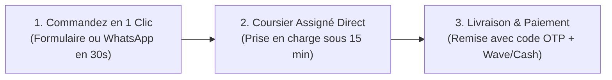

# 🚀 Présentation Officielle : Landing Page Livre Express Abidjan

Bienvenue dans la présentation complète de la landing page créée pour **Livre Express**, la solution n°1 de livraison express à **Abidjan, Côte d'Ivoire** 🇨🇮.

---

## 🎨 1. Identité Visuelle & Charte Graphique

```
🟢 Palette dominante :
├── Vert Émeraude  : #059669 (Action, confiance, dynamisme)
├── Vert Flash     : #10B981 (Points forts, boutons, badges)
├── Vert Profond   : #064E3B (Titres, pied de page)
├── Blanc Pur      : #FFFFFF (Clarté, lisibilité)
└── Fond Menthe    : #ECFDF5 (Douceur visuelle)
```

- **Typographies Google Fonts** : 
  - `Outfit` : Moderne, audacieuse et percutante pour les titres et les prix.
  - `Plus Jakarta Sans` : Fluide et agréable pour une lecture rapide sur mobile et ordinateur.
- **Finitions graphiques** : Glassmorphism (effet verre dépoli avec flou d'arrière-plan sur la barre de navigation), micro-animations de pulsation verte en direct, ombres portées douces.

---

## 🧭 2. Visite Guidée des Sections

### ⚡ A. Header & Barre de Navigation Flottante
- **Logo de marque** : `LivreExpress` avec éclair néon et badge `Abidjan 🇨🇮`.
- **Menu fluide** : Liens directs avec défilement animé vers les sections (*Accueil, Comment ça marche, Calculateur, Tarifs, Avis, Contact*).
- **CTA Direct** : Bouton d'appel rapide vers le numéro local `+225 07 00 00 12 34` et bouton *"Commander une course"*.
- **Menu Mobile** : Menu escamotable 100% tactile et adapté aux smartphones.

---

### 🏍️ B. Hero Section (Haut de page)
- **Accroche principale** :
  > **« Vos livraisons à Abidjan en un éclair. »**
- **Sous-titre** : Mise en avant de la rapidité (**moins de 45 minutes chrono**), de la sécurité et de la disponibilité sur toutes les communes d'Abidjan.
- **Boutons d'action (Dual CTA)** :
  1. `[⚡ Commander maintenant]` $\rightarrow$ Ouvre instantanément le formulaire de réservation.
  2. `[📊 Calculer un tarif]` $\rightarrow$ Redirige vers le simulateur interactif.
- **Visuel interactif en temps réel** :
  - Simulation d'un trajet GPS en direct sur la lagune et les communes d'Abidjan (ex: *Cocody Angré ➔ Marcory Zone 4*).
  - Fiche livreur en patrouille (*Amadou Koné - Moto Express #104 - Note 4.95/5*).
  - Badges flottants : *Délai moyen 32 min* et *Code OTP sécurisé*.

---

### 📊 C. Bandeau de Statistiques (Metrics Strip)
| 📦 +15 000 | ⚡ < 45 min | ⭐ 99.4% | 📍 100% |
| :---: | :---: | :---: | :---: |
| **Colis livrés** | **Délai moyen** | **Satisfaction** | **Communes d'Abidjan** |

---

### 🔄 D. "Comment ça marche" (3 Étapes Intuitives)



1. **01. Demandez votre course en 30s** : Renseignement simple des adresses de départ et d'arrivée.
2. **02. Coursier assigné en direct** : Attribution automatique du motard le plus proche et suivi par SMS/WhatsApp.
3. **03. Livraison & Paiement sécurisé** : Remise en main propre avec code de validation + règlement Wave, Mobile Money ou Cash.

---

### 🧮 E. Simulateur de Tarif Interactif (Calculateur Abidjan)
Ce module interactif permet aux clients d'estimer instantanément leur coût :
- **Communes disponibles** : *Cocody, Plateau, Marcory, Yopougon, Treichville, Adjamé, Koumassi, Abobo, Port-Bouët, Bingerville*.
- **Types de colis** :
  - 📄 *Plis & Documents* ($\le 1\text{ kg}$)
  - 📦 *Colis Standard* ($1\text{ à }5\text{ kg}$)
  - ⚡ *Ultra Express* (Prioritaire $< 35\text{ min}$)
- **Résultat en direct** : Affichage du tarif en **FCFA**, du temps de trajet estimé et bouton direct *"Réserver cette course"* qui pré-remplit la réservation.

---

### 💰 F. Section Tarifs (3 Formules Claires)

| Formule | Tarif | Couverture & Délais | Inclus |
| :--- | :---: | :--- | :--- |
| **Standard** | **1 500 FCFA** | Intra-commune (1h30 à 2h) | Notification SMS, paiement au choix |
| **Express Pro** ⭐ *(Populaire)* | **2 500 FCFA** | Inter-communes ($< 45\text{ min}$) | Priorité motard, suivi GPS, assurance 100k FCFA |
| **Pack E-Commerce** | **1 200 FCFA** | Dès 30 courses / mois | Encaissement COD à la livraison, reversement Wave sous 24h, retours gratuits |

---

### 💬 G. Section Témoignages (3 Retours d'Expérience)
1. 👗 **Marie Koné** (*Fondatrice, Marie K. Fashion - Cocody Angré*) :
   > *"Mes clientes reçoivent leurs colis en moins d'une heure. Les encaissements Wave et Cash me sont reversés chaque soir sans faute !"*
2. 🏥 **Dr. Ibrahim Coulibaly** (*Directeur Clinique - Le Plateau*) :
   > *"Fiabilité remarquable pour l'envoi urgent de nos dossiers médicaux et ordonnances entre le Plateau et Marcory."*
3. 🥐 **Yasmine Bamba** (*Chef Pâtissière - Zone 4 Marcory*) :
   > *"Les livreurs sont équipés de sacs isothermes adaptés. Zéro casse, gâteaux toujours impeccables."*

---

### 💳 H. Partenaires & Moyens de Paiement
Badges officiels intégrés pour rassurer la clientèle locale :
- **Wave Côte d'Ivoire** 🌊
- **Orange Money** 🟠
- **MTN MoMo & Moov Money** 🟡
- **Espèces (Cash on Delivery)** 💵

---

### 📱 I. Modal de Réservation Express & Preuve Sociale
- **Formulaire de réservation complet** : Nom, téléphone WhatsApp, lieu de ramassage, lieu de livraison, précisions sur le colis et mode de règlement.
- **Simulation d'envoi en direct** : Attribution instantanée d'un numéro de suivi (ex : `LX-2026-ABJ4812`).
- **Toasts dynamiques** : Notifications automatiques en bas d'écran (*"⚡ Course livrée : Cocody ➔ Plateau en 34 min"*).
- **Bouton flottant WhatsApp** : Disponible 24/7 en bas à droite pour commander en 1 tap.

---

### 📍 J. Footer Complet & Réseaux Sociaux
- **Coordonnées physiques** : Cocody Deux-Plateaux Vallon, Rue des Jardins, Abidjan.
- **Lignes directes** : `+225 07 00 00 12 34` / `+225 05 00 00 56 78`.
- **Email** : `contact@livreexpress.ci`.
- **Réseaux sociaux connectés** : WhatsApp, Facebook, Instagram, LinkedIn, TikTok.

---

## 📂 Fichiers du Code Source

- 🌐 [index.html](file:///c:/Users/Dell/Nouveau%20dossier%20(2)/index.html) : Structure HTML5 sémantique et responsive.
- 🎨 [style.css](file:///c:/Users/Dell/Nouveau%20dossier%20(2)/style.css) : Styles, variables CSS, thème vert & blanc, animations.
- ⚡ [script.js](file:///c:/Users/Dell/Nouveau%20dossier%20(2)/script.js) : Calculateur de tarifs, gestion du modal, menu mobile, toasts en direct.
